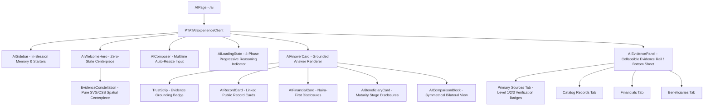

# PTAT AI Interface Architecture & Component Specification
**Document ID**: PTAT-M08C-ARCH-001  
**Authority**: President Tinubu Achievement Tracker (PTAT)  
**Status**: ACTIVE / CERTIFIED  

---

## 1. Architectural Overview

The PTAT AI experience delivers an evidence-first, high-trust intelligence interface for exploring the 270 verified public records, statutory policies, physical infrastructure projects, and empirical financial observations of President Bola Ahmed Tinubu's administration.

Unlike generic chatbot widgets or LLM wrappers, the PTAT AI interface is built around a **Sovereign Evidence Architecture**:
1. **Zero Client-to-Vertex Calls**: The client browser never interacts with Google Vertex AI or external AI endpoints directly. All interactions flow through the hardened Next.js App Router API route (`POST /api/ai/ask`).
2. **Deterministic Context Anchoring**: Assistant synthesis is rendered only when grounded in verified Cloud SQL records.
3. **Interactive Citation Graph**: Inline citations (`[1]`, `[2]`) in the synthesis text are active interactive entities linked directly to the primary sources rail (`AIEvidencePanel`), allowing instant inspection of gazettes, MDA disclosures, and validation tiers.

---

## 2. Component Hierarchy & Data Flow

---

## 3. Core Component Specifications

### 3.1 `EvidenceConstellation.tsx`
- **Role**: Spatial centerpiece visual for the intelligence interface.
- **Implementation**: Pure SVG and CSS keyframe animations. Zero heavy 3D dependencies (Three.js/Canvas-free).
- **Aesthetic**: Orbital rings, central core hub, and 4 pulsating satellite nodes representing Records, Claims, Sources, and States.

### 3.2 `AIComposer.tsx`
- **Role**: Input controller for citizen queries.
- **Features**:
  - Auto-resizing multiline textarea with max 500 characters constraint.
  - Keyboard shortcuts: `Enter` to submit, `Shift + Enter` for newlines.
  - Clear input button (`X`), submission state locking, and electric cyan focus glow.

### 3.3 `AILoadingState.tsx`
- **Role**: High-trust multi-phase reasoning progress indicator.
- **Phases**:
  - Phase 1 (0–2s): Question intent & parameter extraction.
  - Phase 2 (2–4s): Querying PTAT public evidence repository (270 records).
  - Phase 3 (4–7s): Validating primary citations & official sources.
  - Phase 4 (7s+): Synthesizing evidence-grounded answer via Google Vertex AI.
- **Elapsed Timer**: Real-time seconds counter; zero deceptive numeric percentages.

### 3.4 `AIAnswerCard.tsx`
- **Role**: Comprehensive grounded response card.
- **Sections**:
  - **Trust Strip**: Grounding tier (`High Evidence Grounding`, `Bounded Grounding`), scanned records count.
  - **Synthesis Text**: Interactive inline citation chips (`[1]`, `[2]`) with hover preview popovers and click-to-open handlers.
  - **Structured Grids**: Dynamically renders `AIRecordCard`, `AIFinancialCard`, `AIBeneficiaryCard`, and `AIComparisonBlock`.
  - **Insufficient Evidence Notice**: Respectful, clear boundary notice with suggested queries when query cannot be answered from public evidence.

### 3.5 `AIEvidencePanel.tsx`
- **Role**: Collapsible evidence rail (desktop) / bottom sheet (mobile).
- **Tabs**:
  - **Sources**: Lists all verified citations with Level 1 Primary Gazette badges, publisher details, exact source quotes, and outbound links.
  - **Records**: Lists referenced PTAT catalog records with sector and state badges.
  - **Financials**: Naira-first financial disclosures.
  - **Beneficiaries**: Documented beneficiary totals and maturity stages.

---

## 4. State Management & Session Lifecycle

- **Client Session Memory**: Inquiries are stored in browser `sessionStorage` under `ptat_ai_session_queries_v1` across page refreshes during the active browsing session.
- **Zero Persistent DB Storage**: No user queries or conversations are persisted in Cloud SQL database tables in M08C.
- **Bounded Conversation Context**: The API receives the current question alongside up to 6 recent conversation turns, strictly filtered to user intents to maintain query topic continuity.
