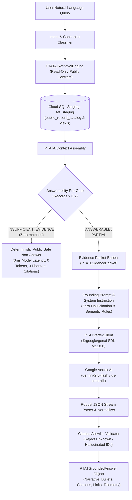

# PTAT Vertex AI Grounded Synthesis Architecture

## 1. Executive Summary & Purpose

The **President Tinubu Achievement Tracker (PTAT)** Grounded Answer Synthesis Engine connects the sealed, read-only M08A public retrieval foundation to Google Cloud Vertex AI (`gemini-2.5-flash` in `us-central1`). It implements an evidence-grounded generative synthesis pipeline enforcing a strict zero-hallucination doctrine:

$$\text{User Query} \longrightarrow \text{M08A Retrieval} \longrightarrow \text{Evidence Packet} \longrightarrow \text{Vertex AI} \longrightarrow \text{Citation Validation} \longrightarrow \text{PTAT Grounded Answer}$$

Under this architecture, general model parametric knowledge is explicitly forbidden from asserting or supplementing substantive Nigerian governance facts. Every factual statement in the final synthesized output must be backed by verified, allowlisted PTAT Claim and Source identifiers retrieved from the 270 public canonical record catalog on Cloud SQL staging (`tat_staging`).

---

## 2. Architectural Pipeline & Component Breakdown

---

## 3. Core Engine Components

### 3.1. Retrieval Service (`src/server/ai/retrieval-service.ts`)
- **Authority**: Sealed M08A/M08A.1 foundation.
- **Contract**: Strictly queries `public_record_catalog`, `public_record_claims`, `public_record_sources`, `public_record_financials`, `public_record_beneficiaries`, and `public_timeline_events`.
- **Zero Base Table Access**: Fully decoupled from physical tables (`records`, `sources`, etc.).
- **Output**: Typed `PTATAIContext` with confidence scoring, intent classifications, and metadata.

### 3.2. Evidence Packet Builder (`src/server/ai/evidence-packet.ts`)
- **Function**: `buildEvidencePacket(context: PTATAIContext): PTATEvidencePacket`
- **Purpose**: Strips redundant internal database keys, isolates bounded public attributes (slugs, titles, verified claims, primary sources, structured financials, beneficiary counts), and produces a token-efficient JSON payload.

### 3.3. Grounding System Instruction (`src/server/ai/synthesis-prompt.ts`)
- **Function**: `buildSystemInstruction()` and `buildSynthesisPrompt(query, packet)`
- **Doctrines Enforced**:
  1. *Zero Hallucination*: Substantive assertions restricted exclusively to supplied packet.
  2. *Financial Semantics*: Commitment $\neq$ expenditure; allocation $\neq$ disbursement; equity guarantee $\neq$ direct grant.
  3. *Beneficiary Semantics*: Trained $\neq$ employed; applicant $\neq$ enrolled $\neq$ certified.
  4. *Geographic Scope*: State-specific vs corridor vs nationwide relevance.
  5. *Comparison Symmetry*: Bilateral evaluation preserving absence of evidence ("no recorded observation" $\neq$ "₦0 spent").
  6. *Strict JSON Schema*: Mandates structured answer, bullet points, and citation arrays.

### 3.4. Vertex AI Client (`src/server/ai/vertex-client.ts`)
- **SDK**: Official `@google/genai` (v2.18.0).
- **Runtime Mode**: `GoogleGenAI({ vertexai: true, project: 'tinubu-achievement-stg', location: 'us-central1' })`.
- **Model**: `gemini-2.5-flash` with deterministic temperature `0.1`, max output tokens `8192`, `thinkingBudget: 0`, and JSON MIME mode.
- **Resilience**: Bounded exponential backoff (2 retries) on transient 429 / network errors.
- **Parser**: Multi-stage robust JSON parser handling unescaped control characters and markdown fences.

### 3.5. Citation Validator (`src/server/ai/citation-validator.ts`)
- **Function**: `validateModelCitations(rawCitations, evidencePacket): CitationValidationResult`
- **Allowlist Verification**:
  * Cross-references every `claimId` against `evidencePacket.claims`.
  * Verifies `sourceId` against the claim's verified sources.
  * Resolves source metadata (`sourceTitle`, `publisher`, `url`, `sourceLevel`).
  * Rejects phantom claim/source IDs with descriptive rejection reasons.
  * Ignores empty or malformed objects without contaminating valid citations.

### 3.6. Master Synthesis Service (`src/server/ai/grounded-synthesis.ts`)
- **Class**: `PTATGroundedSynthesisService`
- **Pre-Gate Rule**: If `context.answerability === 'INSUFFICIENT_EVIDENCE'`, returns deterministic safe non-answer immediately with $0\text{ ms}$ model latency, 0 input/output tokens, and 0 phantom citations.
- **Orchestration**: Seamlessly connects retrieval $\to$ pre-gate $\to$ packet $\to$ vertex $\to$ validation $\to$ answer contract.

---

## 4. Cloud Infrastructure & Security Posture

| Layer | Implementation | Security / Invariant |
|---|---|---|
| **Cloud Project** | `tinubu-achievement-stg` | NEVER targets production (`tinubu-achievement-tracker`). |
| **Model Region** | `us-central1` | Authorized Vertex AI region for `gemini-2.5-flash`. |
| **Authentication** | Google Application Default Credentials (ADC) & Cloud IAM | Zero API keys in source code; IAM role `roles/aiplatform.user`. |
| **Database** | Cloud SQL `tat_staging` (`tat-db-staging`, `europe-west1`) | Connects via IAM proxy with read-only public safe user. |
| **Network** | HTTPS / TLS 1.3 | Encrypted transit to Vertex AI endpoints and Cloud SQL proxy. |
