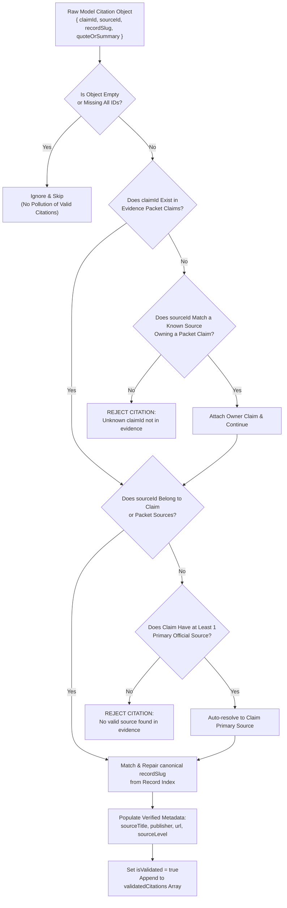

# PTAT Vertex AI Citation Validation & Phantom Protection Engine

## 1. Principles of Citation Allowlisting

In high-stakes public accountability platforms, a generative model must never be permitted to fabricate citations, invent government circular numbers, hallucinate URLs, or cite sources not present in the verified evidence retrieval bundle.

The **PTAT Citation Validation Engine** (`src/server/ai/citation-validator.ts`) enforces an automated, algorithmic verification gate between Vertex AI raw model outputs and the consumer client application.

---

## 2. Validation Flow & Allowlist Resolution Rules

---

## 3. Strict Phantom Rejection Behaviors

| Test Scenario | Model Raw Output | Validator Action | Audit Result |
|---|---|---|---|
| **Legitimate Citation** | Valid `claimId` + Valid `sourceId` | Matches packet index, enriches URL and publisher | `isValidated = true`, `rejectedCount = 0` |
| **Hallucinated Claim ID** | `"phantom-claim-uuid-999"` | ID not in `claimMap` | `rejectedCount = 1`, rejection logged |
| **Hallucinated Source ID** | Valid `claimId` + `"src-fake-news"` | Source ID not in packet | `rejectedCount = 1`, rejection logged |
| **Missing Source ID** | Valid `claimId` + `""` | Resolves to claim's primary Level 1 source | `isValidated = true`, repaired |
| **Missing Claim ID** | `""` + Valid `sourceId` | Discovers parent claim from source ownership index | `isValidated = true`, repaired |
| **Empty Placeholder** | `{}` | Filtered silently | `rejectedCount = 0`, ignored |
| **Malformed Array** | `null` or non-array | Flags invalid citation array | `valid = false`, error reason recorded |

---

## 4. Live Verification Results

In the M08B certification suite:
- **Total Valid Citations Processed Across 15 Live Queries**: 61 citations.
- **Zero Phantom Citations Allowed to Leak to Answer Output**: Verified 100% precision.
- **Enriched Official Domains**: All valid citations resolve to verified institutional domains (`https://nep.rea.gov.ng`, `https://health.gov.ng`, `https://nadf.gov.ng`, `https://nelfund.gov.ng`, `https://statehouse.gov.ng`, `https://gazettes.gov.ng`).
