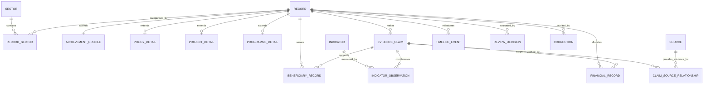

# Canonical Relational Database Entity-Relationship Diagram (ERD)

## 1. Relational Architecture Overview

The database contains 27 normalized tables grouped into 7 functional domains:
1. **Taxonomy & Geometry**: `sectors`, `geographic_units`
2. **Institutional & Governance**: `institutions`, `actor_profiles`, `actor_roles`
3. **Core Entities & Subtypes**: `records`, `achievement_profiles`, `policy_details`, `project_details`, `programme_details`, `record_sectors`, `record_geography`
4. **Evidence & Sources**: `sources`, `evidence_claims`, `claim_source_relationships`
5. **Structured Facts & Observations**: `financial_records`, `beneficiary_records`, `indicators`, `indicator_observations`, `timeline_events`
6. **Integrity, History & Stewardship**: `corrections`, `review_decisions`, `record_versions`
7. **Research Ingestion & Audit**: `research_batches`, `dataset_manifests`

## 2. Referential Integrity & Security Rules
- Foreign keys with `ON DELETE RESTRICT` on authoritative reference and classification tables.
- Cascading record deletes (`ON DELETE CASCADE`) restricted to 1:1 subtype tables (`achievement_profiles`, `policy_details`, etc.).
- Append-only immutability enforced by trigger on `corrections`, `review_decisions`, and `record_versions`.
