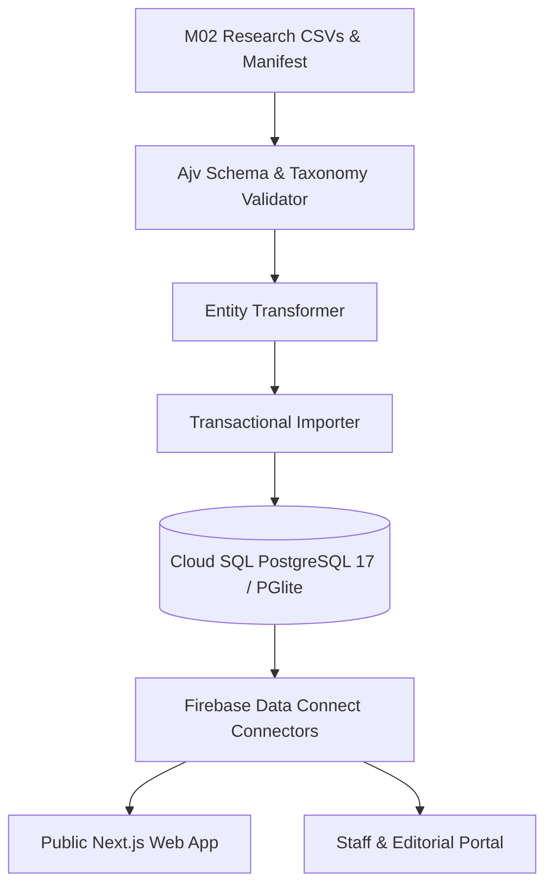

# Firebase Data Connect & Relational Architecture Specification

## 1. Architectural Strategy

The Tinubu Achievement Tracker V2 architecture uses a Google-native relational infrastructure consisting of:
- **Relational Engine**: Google Cloud SQL for PostgreSQL 17.
- **Service Layer**: Firebase Data Connect (SQL Connect) providing type-safe GraphQL connector schemas and queries (`dataconnect/`).
- **Hosting Target**: Firebase App Hosting (Serverless Next.js App Router).
- **Authentication**: Firebase Authentication with custom claims for RBAC.
- **Local Engine**: `@electric-sql/pglite` executing PostgreSQL 17 in-process for testing and local development without cloud dependencies.

## 2. Connector Definitions

### Public Connector (`dataconnect/public/`)
- Read-only queries against published catalog records, verified sources, aggregate metrics, and public timeline events.
- Anonymously accessible by default with `@auth(level: PUBLIC)`.

### Staff Connector (`dataconnect/staff/`)
- Mutations and workflow queries for research ingestion, evidence verification, gate decision recording, and batch rollback.
- Restricted to authenticated reviewers and administrators with `@auth(level: USER)`.
