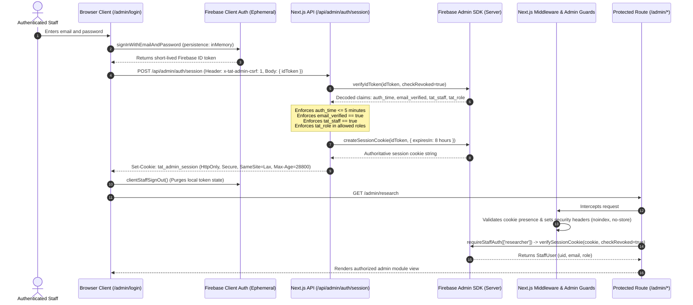

# TINUBU ACHIEVEMENT TRACKER V2
## Technical Architecture: Staff Authentication & Editorial Isolation (Mission 10E / 10E-FINAL-GATE)

---

## 1. Executive Summary & Purpose

Mission 10E establishes the authoritative, server-verified authentication and role-based access control (RBAC) foundation for internal editorial, research, review, and administrative personnel of the Tinubu Achievement Tracker.

The architecture is governed by two fundamental security imperatives:
1. **Public Site Anonymity (Zero-Login Immunity):** Public visitors, researchers, journalists, and citizens access the platform without authentication or accounts. No public viewer role, user registration, or anonymous Firebase session is permitted.
2. **Server-Authoritative RBAC & Editorial Isolation:** Administrative privileges and editorial routes are gated by server-side Firebase Admin SDK session verification and cryptographic claims (`tat_staff: true`, `tat_role: <role>`). No client-side token or local storage claim is trusted.
3. **Public Database Boundary:** The public runtime database identity (`tat-staging-db-app@...` / `tat_public_reader`) has `SELECT` access ONLY through the four authorized public views (`public_record_catalog`, `public_claim_evidence`, `public_financial_records`, `public_beneficiary_records`). Direct `SELECT` on all 27 canonical base tables is strictly **DENIED**. All write operations (`INSERT`, `UPDATE`, `DELETE`, `TRUNCATE`, `ALTER`, `CREATE`) are strictly **DENIED**.

---

## 2. Authentication Flow & Lifecycle

---

## 3. Core Architectural Components

### A. Ephemeral Client SDK (`src/lib/auth/firebase-client.ts`)
- Configured with `inMemoryPersistence` (fallback to `browserSessionPersistence`).
- Tokens and passwords are never persisted to `localStorage` or `IndexedDB`.
- Immediately upon session cookie exchange, the client SDK signs out to eliminate client memory exposure.

### B. Server Session Engine (`src/lib/server/session.ts`)
- **Cookie Name:** `tat_admin_session`
- **Lifetime:** 8 hours (28,800 seconds).
- **Attributes:** `HttpOnly`, `Secure` (in production/staging), `SameSite=Lax`, `Path=/`.
- **Validation Rules:**
  - Token signature and revocation check (`checkRevoked: true`).
  - Recent authentication check (`auth_time` age <= 5 minutes / 300 seconds).
  - `email_verified === true` (unverified accounts cannot obtain session cookies).
  - `tat_staff === true` (custom claim set only by authorized backend procedures).
  - `tat_role` must match one of the 4 canonical roles (`super_admin`, `researcher`, `reviewer`, `publisher`).

### C. Server Component Guards (`src/lib/server/admin-guard.ts`)
- Authoritative server guard `requireStaffAuth(allowedRoles?: StaffRole[])`.
- Executes inside React Server Components before any sensitive data is fetched or rendered.
- Unauthenticated requests trigger `redirect('/admin/login')`.
- Unauthorized roles trigger `redirect('/admin/unauthorized')` (403 Forbidden).

### D. Anti-CSRF Protection (`src/lib/server/csrf.ts`)
- All state-changing auth endpoints (`/api/admin/auth/session` and `/api/admin/auth/logout`) require:
  - Custom header `x-tat-admin-csrf: 1`, OR
  - Same-origin `Origin` / `Referer` validation matching request `Host`.

### E. Security Headers & Search Indexing Immunity (`src/middleware.ts`)
- All `/admin/*` routes receive:
  - `X-Robots-Tag: noindex, nofollow, noarchive, nosnippet, noimageindex`
  - `Cache-Control: no-store, no-cache, must-revalidate, proxy-revalidate, private`
  - `Pragma: no-cache`
  - `Expires: 0`

---

## 4. Public Site & Database Non-Interference Guarantee

The public site is completely decoupled from authentication:
- Public routes (`/`, `/achievements`, `/policies`, `/projects`, `/programmes`, `/sectors`, `/timeline`, `/impact-map`, `/api/health`) execute with zero auth middleware overhead.
- Database access by public runtime identity (`tat-staging-db-app@...` / `tat_public_reader`) is restricted to **`SELECT` ONLY through four approved public views**:
  1. `public_record_catalog`
  2. `public_claim_evidence`
  3. `public_financial_records`
  4. `public_beneficiary_records`
- Direct `SELECT` on all 27 canonical base tables is completely **DENIED**.
- All write operations (`INSERT`, `UPDATE`, `DELETE`, `TRUNCATE`, `ALTER`, `CREATE`) are completely **DENIED**.
- Public components bundle 0 bytes of Firebase Admin SDK or administrative secrets.
