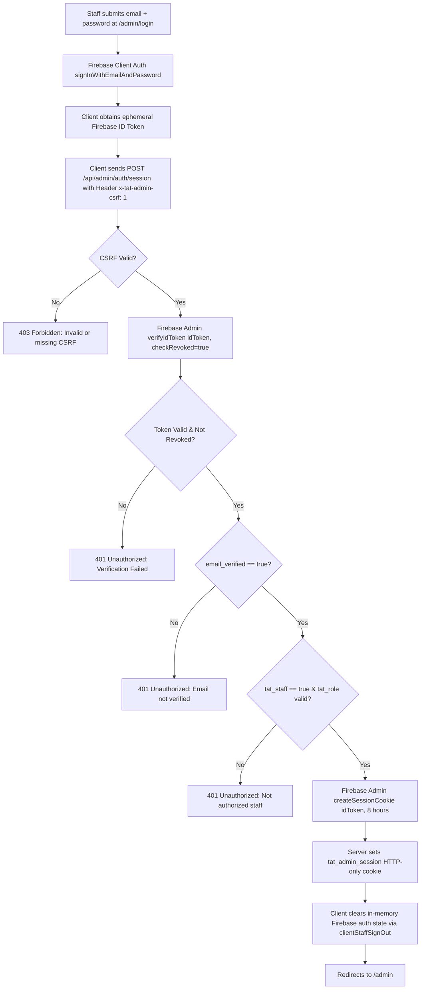

# TINUBU ACHIEVEMENT TRACKER V2
## Session Management, Cookie Security & Anti-CSRF Specifications (Mission 10E)

---

## 1. Session Architecture & Cookie Invariants

Staff authentication creates a cryptographically signed, server-verifiable session cookie issued via Firebase Admin SDK.

### Cookie Configuration:
- **Name:** `tat_admin_session`
- **Max Age:** 28,800 seconds (8.0 hours).
- **HttpOnly:** `true` (Inaccessible to JavaScript `document.cookie`).
- **Secure:** `true` in production/staging environments (HTTPS-only transmission).
- **SameSite:** `Lax` (Protects against cross-site request forgery while permitting top-level navigation).
- **Path:** `/`

---

## 2. Token Exchange & Session Creation Protocol

---

## 3. Session Revocation & Logout Protocol

- **Endpoint:** `POST /api/admin/auth/logout`
- **Actions:**
  1. Validates Anti-CSRF header `x-tat-admin-csrf: 1`.
  2. Extracts session cookie from incoming request.
  3. Calls `adminAuth.revokeRefreshTokens(decoded.uid)` to invalidate all tokens globally in Firebase backend.
  4. Issues clearing `Set-Cookie: tat_admin_session=; Max-Age=0; Path=/; HttpOnly`.
  5. Returns `{ success: true }`.

---

## 4. Anti-CSRF Defense Model

To protect state-changing administrative API routes against cross-site exploitation:
1. **Custom Header Enforcement:** The client sends custom header `x-tat-admin-csrf: 1`. Standard HTML `<form>` submissions and cross-origin fetch requests cannot attach custom headers without preflight approval.
2. **Origin & Referer Validation:** The server cross-verifies request `Origin` and `Referer` against the server's `Host` header.
3. **SameSite Cookie Context:** The `SameSite=Lax` attribute on `tat_admin_session` prevents automatic cookie attachment on cross-origin POST requests.
