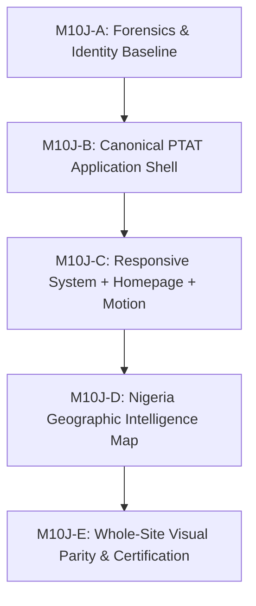

# ============================================================
# PTAT M10J-A — FRONTEND FORENSICS & PRODUCT IDENTITY BASELINE
# CANONICAL FORENSIC INSPECTION & RECONCILIATION DOCUMENT
# ============================================================

**Product:** President Tinubu Achievement Tracker (PTAT)  
**Mission:** M10J-A — Frontend Forensics & Product Identity Baseline  
**Authority:** Command Centre  
**Baseline SHA:** `fab1bacf18ded77da40443c3e1e1b7c22e786416`  
**Dedicated Worktree:** `C:\Users\DELL\Documents\111 ANTI & CODEX\TINUBU ACHIEVEMENTS TRACKER-ANTIGRAVITY-M10J`  
**Branch:** `antigravity/mission-10j-frontend-forensics`  

---

## 1. Canonical Product Identity & Scope Classification

The permanent public-facing brand identity is established as:
- **Full Brand Name:** President Tinubu Achievement Tracker
- **Canonical Acronym:** PTAT
- **Display Standard:** `PTAT` / `President Tinubu Achievement Tracker`

### Classification Rules:
- **Class A (USER-FACING BRAND):** Rename to `PTAT` / `President Tinubu Achievement Tracker` during frontend remediation.
- **Class B (INTERNAL SAFE-TO-RENAME):** Internal code variables and view titles; candidate for scheduled alignment.
- **Class C (INFRASTRUCTURE / STABLE IDENTIFIER):** Retain unchanged (`tat-staging`, `tat-admin-api-staging`, `tat-db-staging`, `tat_staging`, `tat_admin_writer_m10f`, Cloud Run / Cloud SQL / App Hosting identifiers).
- **Class D (HISTORICAL / AUDIT REFERENCE):** Retain unchanged (Past mission documentation, migration scripts, ledger logs).
- **Class E (AMBIGUOUS):** Report to Command Centre for explicit guidance.

---

## 2. Core Forensic Findings & Root Cause Analysis

### Question 1 & Section 4: Duplicate Public Headers & Footers
- **Symptom:** Two navigation bars (headers) and two footers render simultaneously on multiple public pages.
- **Root Cause Analysis:**
  1. `RootLayout` (`src/app/layout.tsx`) embeds `Providers` (`src/app/providers.tsx`).
  2. `Providers` permanently wraps all children in `<AppShell>` (`src/components/layout/AppShell.tsx` lines 15 & 17), which unconditionally renders `<GlobalHeader />` at the top and `<GlobalFooter />` at the bottom of EVERY page.
  3. However, legacy page views in `src/views/` independently import and render an inner `<Navbar />` and `<Footer />`:
     - `src/views/ImpactMapPage.tsx` (Line 18 `<Navbar />`, Line 71 `<Footer />`)
     - `src/views/StatesCatalogue.tsx` (Line 40 `<Navbar />`, Line 167 `<Footer />`)
     - `src/views/PolicyDetail.tsx` (Line 34 & 68 `<Navbar />`, Line 49 & 240 `<Footer />`)
     - `src/views/Dashboard.tsx` (Line 178 `<Navbar />`, Line 571 `<Footer />`)
     - `src/views/EconomicReforms.tsx` (Line 147 `<Navbar />`, Line 382 `<Footer />`)
     - `src/views/Infrastructure.tsx` (Line 153 `<Navbar />`, Line 353 `<Footer />`)
     - `src/views/SecurityProgress.tsx` (Line 131 `<Navbar />`, Line 477 `<Footer />`)
     - `src/views/SocialServices.tsx` (Line 48 `<Navbar />`, Line 462 `<Footer />`)
  4. **Render Tree on `/impact-map`:**
     ```text
     RootLayout (src/app/layout.tsx)
       └── Providers (src/app/providers.tsx)
             └── AppShell (src/components/layout/AppShell.tsx)
                   ├── GlobalHeader (src/components/layout/GlobalHeader.tsx)  <-- Header 1 (Global)
                   ├── PageMain
                   │     └── ImpactMapPage (src/views/ImpactMapPage.tsx)
                   │           ├── Navbar (src/components/layout/Navbar.tsx)  <-- Header 2 (Inner Legacy)
                   │           ├── HeroSection
                   │           ├── NigeriaImpactMap
                   │           └── Footer (src/components/layout/Footer.tsx)  <-- Footer 1 (Inner Legacy)
                   └── GlobalFooter (src/components/layout/GlobalFooter.tsx)  <-- Footer 2 (Global)
     ```

---

### Question 2 & Section 5: Mobile vs Desktop Design Generation
- **Symptom:** Mobile appears to render an older design generation while desktop renders the newer design.
- **Root Cause Analysis:**
  1. The codebase does NOT contain separate mobile/desktop homepage files, but rather legacy view templates vs modern V2 component suites.
  2. On pages using legacy views (e.g. `/states`, `/impact-map`, `/policies/[slug]`), the inner `<Navbar />` has a legacy mobile drawer (`MobileMenu.tsx`), while `<GlobalHeader />` has the modern `<MobileNavigationDrawer />`.
  3. In `GlobalHeader.tsx` (Line 25), the mobile trigger button uses `lg:hidden`, while in `DesktopNavigation.tsx` (Line 50), the desktop navigation uses `hidden xl:flex`.
  4. Between 1024px (`lg`) and 1279px (`xl`), a 255px layout dead-zone exists where desktop navigation is hidden but the mobile hamburger is also hidden.
  5. The target architecture for M10J is **ONE SEMANTIC APPLICATION SHELL & HOMEPAGE + RESPONSIVE ADAPTATION**.

---

### Question 3 & Section 6: Horizontal Overflow
- **Symptom:** Horizontal scrollbars and document width exceeding viewport width on mobile/tablet viewports.
- **Root Cause Analysis:**
  1. Unwrapped tables in `src/views/DataExplorer.tsx` (`min-w-[280px]` on columns without responsive scroll containers) and `src/views/TimelinePage.tsx` (`min-w-[260px]`).
  2. Map container fixed SVG coordinate system in `src/components/geography/NigeriaMapSvg.tsx` (`viewBox="0 0 1000 800"`) inside unconstrained flex items.
  3. Fixed badge and metric containers in `src/views/StateDetail.tsx` (`min-w-[120px]` in horizontal flex wraps).
  4. Overcrowded top-level header item containers without flex shrink protection.
- **Remediation Acceptance Criterion:** `document.documentElement.scrollWidth <= document.documentElement.clientWidth` across all breakpoints without relying on bandaid `overflow-x: hidden`.

---

### Question 4 & Section 7: Desktop Brand Truncation
- **Symptom:** Brand title "Tinubu Achievement Tracker" renders truncated as "Tinubu Ach..." on desktop screens.
- **Root Cause Analysis:**
  1. In `src/components/layout/BrandLockup.tsx` (Line 29), the brand title text has class `truncate` on `<span className="... truncate">`.
  2. In `src/components/layout/DesktopNavigation.tsx`, 7 top-level navigation categories plus dropdown chevrons occupy > 850px of horizontal width.
  3. In `src/components/layout/HeaderActions.tsx`, search triggers, language selectors, and theme toggles occupy > 220px.
  4. On 1280px viewports (standard `xl`), the available space for the left brand lockup is squeezed below 260px, triggering CSS truncation.

---

### Question 5 & Section 8: Missing White Homepage CTA Label
- **Symptom:** The secondary homepage hero CTA appears as a blank white box with an icon but no visible label.
- **Root Cause Analysis:**
  1. In `src/components/home/HomeHero.tsx` (Lines 49–59):
     ```tsx
     <Button
       size="lg"
       variant="outline"
       className="border-gov-border/60 hover:bg-white/10 text-white font-semibold text-sm px-6 py-3 h-12 gap-2 rounded-xl"
       asChild
     >
       <Link to="/impact-map">
         <Compass className="h-4 w-4 text-gov-emerald" />
         <span>Nigeria Impact Map</span>
       </Link>
     </Button>
     ```
  2. In `src/components/ui/button.tsx` (Lines 15–16), the `outline` variant injects:
     `outline: "border border-input bg-background hover:bg-accent hover:text-accent-foreground"`
  3. In light theme, `bg-background` evaluates to `#ffffff` (pure white background).
  4. The inner text has class `text-white` (`#ffffff` text).
  5. **Result:** Pure white text on pure white background $\rightarrow$ text label "Nigeria Impact Map" is 100% invisible.

---

### Question 9 & Section 10: Map Architecture & Pseudo-Map Generation
- **Symptom:** Nigeria map renders as an abstract mosaic of geometric rectangular blocks.
- **Root Cause Analysis:**
  1. **Source File:** `src/data/geography/nigeria-states.geojson.ts`
  2. **Rendering Component:** `src/components/geography/NigeriaMapSvg.tsx` consumed by `src/components/geography/NigeriaImpactMap.tsx`.
  3. **Data Structure:** The dataset `nigeriaStatePaths` defines 37 states using simplified 4-to-5-point rectangular polygon bounding boxes (e.g. Abia: `M555,635 L585,635 L590,660 L560,670 Z`, Lagos: `M150,625 L250,625 L250,655 L150,655 Z`).
  4. Real geopolitical boundary multipolygons from official Admin-1 GeoJSON/TopoJSON were never compiled into the SVG path generator.

---

### Question 8 & Section 9: Motion & Animation Infrastructure
- **Existing Libraries:** `@gsap/react` (^2.1.2), `gsap` (^3.12.5), `ScrollTrigger` plugin, `@radix-ui/react-*`, Tailwind CSS transitions/keyframes.
- **Source Utilities:** `src/lib/animations.ts` already contains GSAP presets: `fadeInUp`, `fadeInLeft`, `fadeInRight`, `scaleIn`, `createScrollTrigger`, `staggerChildren`, `textReveal`, `counterAnimation`, `parallaxEffect`, `kenBurnsEffect`.
- **Finding:** No new animation libraries are required. Reusable timing classes (Fast: 150–200ms, Standard: 250–350ms, Slow: 500–700ms) can be fully implemented with existing GSAP and Tailwind infrastructure.

---

## 3. Public Page Generation Inventory & Classification

| Route | Page File | View Component | Status | Classification |
| :--- | :--- | :--- | :--- | :--- |
| `/` | `src/app/page.tsx` | `src/views/Index.tsx` | Active | **NEW DESIGN SYSTEM** (V2 modular narrative) |
| `/achievements` | `src/app/achievements/page.tsx` | `src/views/AchievementsCatalogue.tsx` | Active | **NEW DESIGN SYSTEM** (Filterable catalogue) |
| `/achievements/[slug]` | `src/app/achievements/[slug]/page.tsx` | `src/views/AchievementDetail.tsx` | Active | **NEW DESIGN SYSTEM** (Audited record detail) |
| `/sectors` | `src/app/sectors/page.tsx` | `src/views/SectorsCatalogue.tsx` | Active | **NEW DESIGN SYSTEM** (15 canonical sectors) |
| `/sectors/[slug]` | `src/app/sectors/[slug]/page.tsx` | `src/views/SectorDetail.tsx` | Active | **NEW DESIGN SYSTEM** (Sector intelligence hub) |
| `/projects` | `src/app/projects/page.tsx` | `src/views/ProjectsCatalogue.tsx` | Active | **NEW DESIGN SYSTEM** (Capital projects) |
| `/policies` | `src/app/policies/page.tsx` | `src/views/PoliciesCatalogue.tsx` | Active | **NEW DESIGN SYSTEM** (Statutory policies) |
| `/policies/[slug]` | `src/app/policies/[slug]/page.tsx` | `src/views/PolicyDetail.tsx` | Active | **MIXED / LEGACY** (Renders inner `<Navbar />` + `<Footer />`) |
| `/programmes` | `src/app/programmes/page.tsx` | `src/views/ProgrammesCatalogue.tsx` | Active | **NEW DESIGN SYSTEM** (Social interventions) |
| `/timeline` | `src/app/timeline/page.tsx` | `src/views/TimelinePage.tsx` | Active | **NEW DESIGN SYSTEM** (Chronological milestones) |
| `/impact-map` | `src/app/impact-map/page.tsx` | `src/views/ImpactMapPage.tsx` | Active | **MIXED / LEGACY** (Renders inner `<Navbar />`, pseudo-map) |
| `/states` | `src/app/states/page.tsx` | `src/views/StatesCatalogue.tsx` | Active | **MIXED / LEGACY** (Renders inner `<Navbar />` + `<Footer />`) |
| `/states/[slug]` | `src/app/states/[slug]/page.tsx` | `src/views/StateDetail.tsx` | Active | **NEW DESIGN SYSTEM** (Subnational state profile) |
| `/data` | `src/app/data/page.tsx` | `src/views/DataExplorer.tsx` | Active | **NEW DESIGN SYSTEM** (Data Explorer table) |
| `/downloads` | `src/app/downloads/page.tsx` | `src/views/Downloads.tsx` | Active | **NEW DESIGN SYSTEM** (Download centre) |
| `/sources` | `src/app/sources/page.tsx` | `src/views/DataSources.tsx` | Active | **NEW DESIGN SYSTEM** (Evidence hierarchy) |
| `/dashboard` | `src/app/dashboard/page.tsx` | `src/views/Dashboard.tsx` | Legacy | **LEGACY DESIGN SYSTEM** (Renders inner `<Navbar />`) |
| N/A | (Unrouted view) | `src/views/EconomicReforms.tsx` | Dead Code | **LEGACY DESIGN SYSTEM** |
| N/A | (Unrouted view) | `src/views/Infrastructure.tsx` | Dead Code | **LEGACY DESIGN SYSTEM** |
| N/A | (Unrouted view) | `src/views/SecurityProgress.tsx` | Dead Code | **LEGACY DESIGN SYSTEM** |
| N/A | (Unrouted view) | `src/views/SocialServices.tsx` | Dead Code | **LEGACY DESIGN SYSTEM** |

---

## 4. Brand / PTAT Rename Matrix

| File | Line / Context | Current Value | Classification | Proposed Value | Change Now? | Rationale |
| :--- | :--- | :--- | :--- | :--- | :--- | :--- |
| `src/app/layout.tsx` | Line 17 (Title default) | `Tinubu Achievement Tracker...` | Class A | `President Tinubu Achievement Tracker...` | NO (M10J-B) | Public page metadata |
| `src/app/layout.tsx` | Line 18 (Title template) | `%s \| Tinubu Achievement Tracker` | Class A | `%s \| President Tinubu Achievement Tracker` | NO (M10J-B) | Public page title template |
| `src/app/layout.tsx` | Line 34 (Publisher) | `Tinubu Achievement Tracker` | Class A | `President Tinubu Achievement Tracker` | NO (M10J-B) | SEO metadata |
| `src/app/layout.tsx` | Line 51 (OpenGraph siteName) | `Tinubu Achievement Tracker` | Class A | `President Tinubu Achievement Tracker` | NO (M10J-B) | Social sharing metadata |
| `src/components/layout/BrandLockup.tsx` | Line 20 (aria-label) | `Tinubu Achievement Tracker - ...` | Class A | `President Tinubu Achievement Tracker - ...` | NO (M10J-B) | Header brand lockup |
| `src/components/layout/BrandLockup.tsx` | Line 24 (Badge acronym) | `TAT` | Class A | `PTAT` | NO (M10J-B) | Header brand badge |
| `src/components/layout/BrandLockup.tsx` | Line 30 (Brand text) | `Tinubu Achievement Tracker` | Class A | `President Tinubu Achievement Tracker` | NO (M10J-B) | Header visible logo title |
| `src/components/layout/GlobalFooter.tsx` | Line 128 (Editorial standard) | `The Tinubu Achievement Tracker...` | Class A | `The President Tinubu Achievement Tracker (PTAT)...` | NO (M10J-B) | Footer editorial statement |
| `src/components/layout/GlobalFooter.tsx` | Line 135 (Copyright) | `Tinubu Achievement Tracker (TAT)` | Class A | `President Tinubu Achievement Tracker (PTAT)` | NO (M10J-B) | Footer copyright line |
| `src/components/SEO/PageHead.tsx` | Line 15 (Default title) | `Tinubu Achievement Tracker...` | Class A | `President Tinubu Achievement Tracker...` | NO (M10J-B) | Component SEO helper |
| `src/app/page.tsx` | Line 7 (Metadata title) | `Tinubu Achievement Tracker \| ...` | Class A | `President Tinubu Achievement Tracker \| ...` | NO (M10J-B) | Homepage title |
| `src/app/achievements/page.tsx` | Line 7 (Metadata title) | `... \| Tinubu Achievement Tracker` | Class A | `... \| President Tinubu Achievement Tracker` | NO (M10J-B) | Achievements catalog title |
| `src/app/admin/login/page.tsx` | Admin Login UI | `Tinubu Achievement Tracker Admin` | Class A | `President Tinubu Achievement Tracker Control Plane` | NO (M10J-B) | Staff login shell |
| `src/server/admin/admin-control-plane-client.ts` | Cloud Run Service Name | `tat-admin-api-staging` | Class C | `tat-admin-api-staging` (RETAIN) | NO | Cloud infrastructure name |
| `src/lib/server/database.ts` | DB IAM Role | `tat_admin_writer_m10f` | Class C | `tat_admin_writer_m10f` (RETAIN) | NO | PostgreSQL IAM role |
| `firebase.json` / `apphosting.yaml` | Backend Target | `tat-staging` | Class C | `tat-staging` (RETAIN) | NO | Firebase App Hosting target |

---

## 5. Canonical Defect Register

| Defect ID | Severity | Category | Component / Path | Description | Remediation Target |
| :--- | :--- | :--- | :--- | :--- | :--- |
| **DEF-01** | **P0 (Critical)** | Shell Architecture | `src/views/*.tsx` vs `AppShell.tsx` | Dual header and dual footer rendering on `/impact-map`, `/states`, `/policies/[slug]`, `/dashboard` | M10J-B |
| **DEF-02** | **P0 (Critical)** | Accessibility / UI | `src/components/home/HomeHero.tsx` | White CTA label invisible due to `text-white` on `bg-background` (#ffffff) | M10J-C |
| **DEF-03** | **P1 (Major)** | Brand Identity | `src/components/layout/BrandLockup.tsx` | Brand title truncated on desktop 1280px due to `truncate` and overloaded nav bar | M10J-B |
| **DEF-04** | **P1 (Major)** | Layout / Overflow | `src/views/DataExplorer.tsx`, `TimelinePage.tsx` | Horizontal overflow on mobile/tablet from unwrapped fixed min-width table cells | M10J-C |
| **DEF-05** | **P1 (Major)** | Responsive Gap | `GlobalHeader.tsx` vs `DesktopNavigation.tsx` | Breakpoint dead zone between 1024px (`lg:hidden`) and 1280px (`hidden xl:flex`) | M10J-B |
| **DEF-06** | **P1 (Major)** | Geospatial / UI | `src/data/geography/nigeria-states.geojson.ts` | Abstract 4-point rectangular block polygons instead of real state boundary geometry | M10J-D |
| **DEF-07** | **P2 (Minor)** | Information Architecture | `src/components/layout/DesktopNavigation.tsx` | Overcrowded top-level navigation causing header crowding and visual noise | M10J-B |
| **DEF-08** | **P2 (Minor)** | Brand Alignment | Global Metadata & Footers | Legacy "TAT" / "Tinubu Achievement Tracker" branding across 45+ files | M10J-B / M10J-E |
| **DEF-09** | **P2 (Minor)** | Dead Code | `src/views/EconomicReforms.tsx`, etc. | 4 unrouted legacy views importing obsolete `<Navbar />` and `<Footer />` | M10J-B |
| **DEF-10** | **P3 (Cosmetic)** | Motion System | `src/components/home/*.tsx` | Static spotlight cards and lack of standardized motion language tokens | M10J-C |

---

## 6. Phased Remediation Plan



### Phase M10J-B: Canonical PTAT Application Shell
- **Objective:** Establish a single unified public application shell (`PTATAppShell`), eliminate duplicate inner `<Navbar />`/`<Footer />` calls, fix header breakpoint dead zone (1024px–1279px), apply PTAT brand lockup without truncation, simplify desktop navigation hierarchy, remove dead legacy view imports.
- **Affected Files:** `AppShell.tsx`, `GlobalHeader.tsx`, `BrandLockup.tsx`, `DesktopNavigation.tsx`, `MobileNavigationDrawer.tsx`, `GlobalFooter.tsx`, `src/views/*.tsx`.
- **Acceptance Criteria:** Exactly ONE header and ONE footer rendered across all 15 public routes; brand displays "President Tinubu Achievement Tracker" without truncation on 1280px+; mobile drawer triggers cleanly on all screens < 1024px.

### Phase M10J-C: Responsive System + Homepage Restoration + Motion
- **Objective:** Fix white CTA invisible label in `HomeHero.tsx`, eliminate horizontal overflow across all viewports (360px–1728px), implement standardized GSAP/Tailwind motion language (150ms–700ms), dynamic achievement spotlight rotation, responsive grid refactor for Data Explorer and Timeline tables.
- **Affected Files:** `HomeHero.tsx`, `HomeTrustRail.tsx`, `NationalProgressOverview.tsx`, `DataExplorer.tsx`, `TimelinePage.tsx`, `src/lib/animations.ts`.
- **Acceptance Criteria:** `document.documentElement.scrollWidth <= document.documentElement.clientWidth` across all breakpoints; all 3 hero CTAs have high-contrast visible text; smooth GSAP scroll triggers and card micro-interactions.

### Phase M10J-D: Nigeria Geographic Intelligence Map
- **Objective:** Replace pseudo-block rectangular polygons with accurate, lightweight SVG state boundary paths (Admin-1 Level); implement interactive hover/selection states, geopolitical zone filtering, accessible table fallback, and responsive state impact drawer.
- **Affected Files:** `nigeria-states.geojson.ts`, `NigeriaMapSvg.tsx`, `NigeriaImpactMap.tsx`, `GeographicTableView.tsx`, `MapSelectionPanel.tsx`.
- **Acceptance Criteria:** Accurate Nigeria geographic outline; 36 States + FCT selectable with keyboard and mouse; 0 horizontal layout breakage on mobile.

### Phase M10J-E: Whole-Site Visual Consistency & Visual Certification
- **Objective:** Propagate PTAT brand and design system tokens across all public pages, verify color contrast tokens, execute browser visual regression checks at 8 certified breakpoints (360×800, 390×844, 430×932, 768×1024, 1024×768, 1280×800, 1440×900, 1728×900).
- **Acceptance Criteria:** 100% route visual parity; 0 P0/P1 defects; full Vitest/TypeScript/Next.js build pass.

---

## 7. Operational Invariants & Safeguards

- **Runtime Source Modified in M10J-A:** **NONE**
- **Database Mutated:** **NO**
- **Cloud Infrastructure Touched:** **NO**
- **Production Accessed:** **NO**
- **AI Integration Performed:** **NO**

---

*Forensics complete. Document locked. Ready for Command Centre review.*
